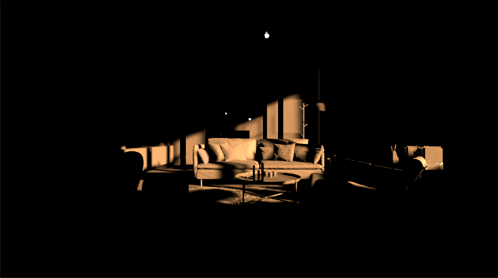
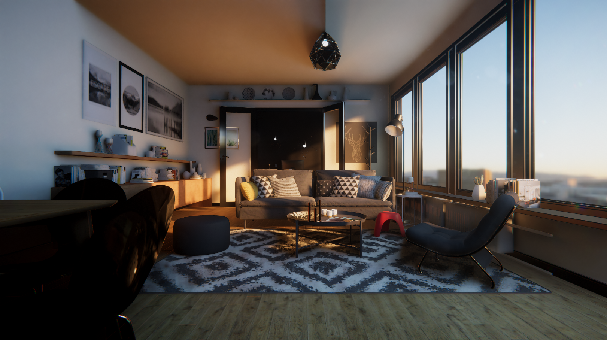
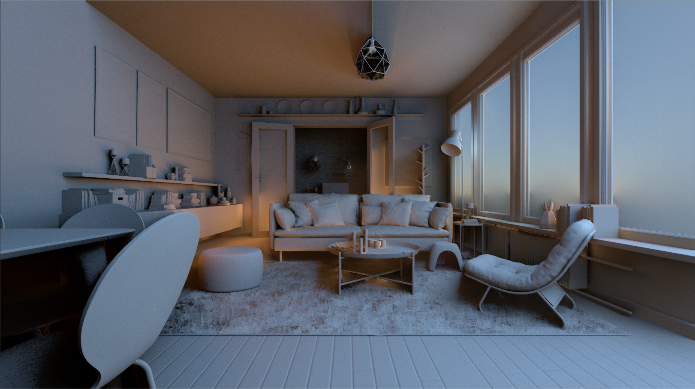
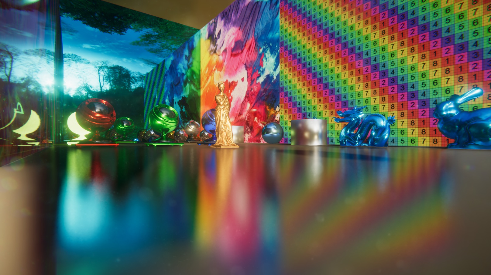
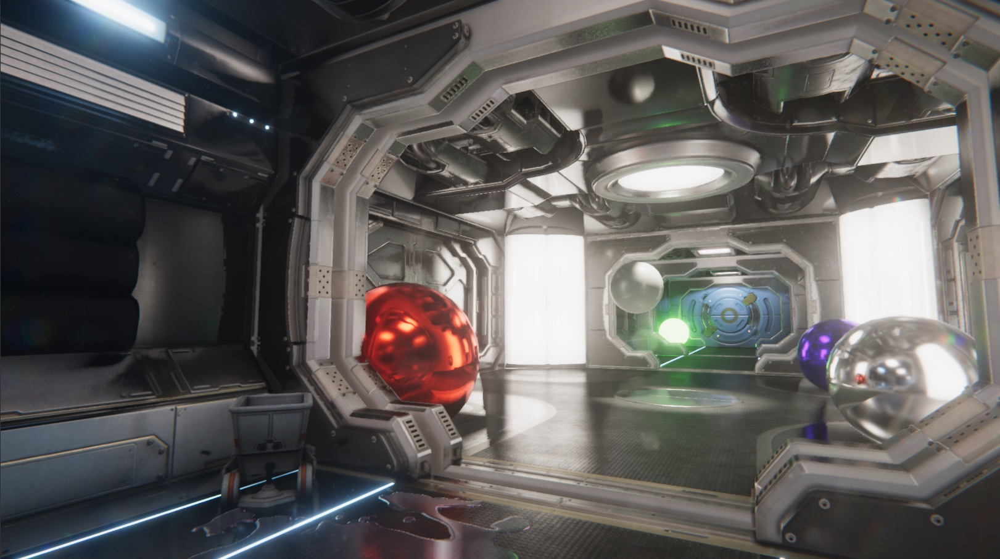
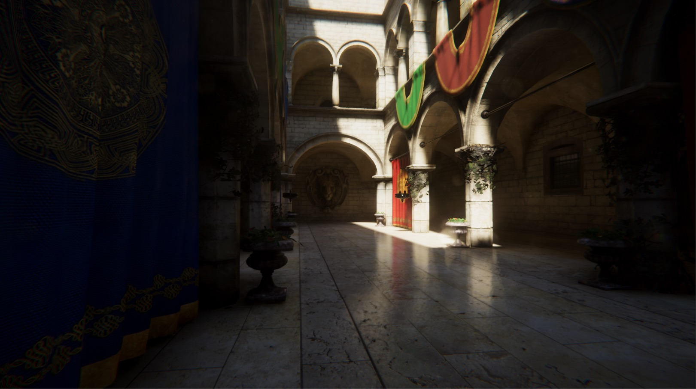
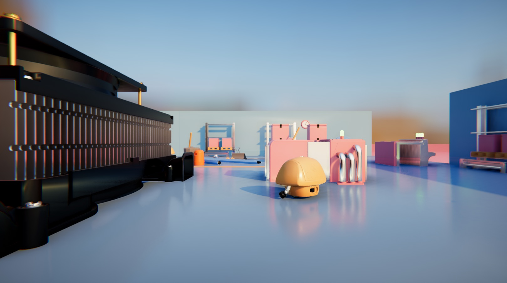
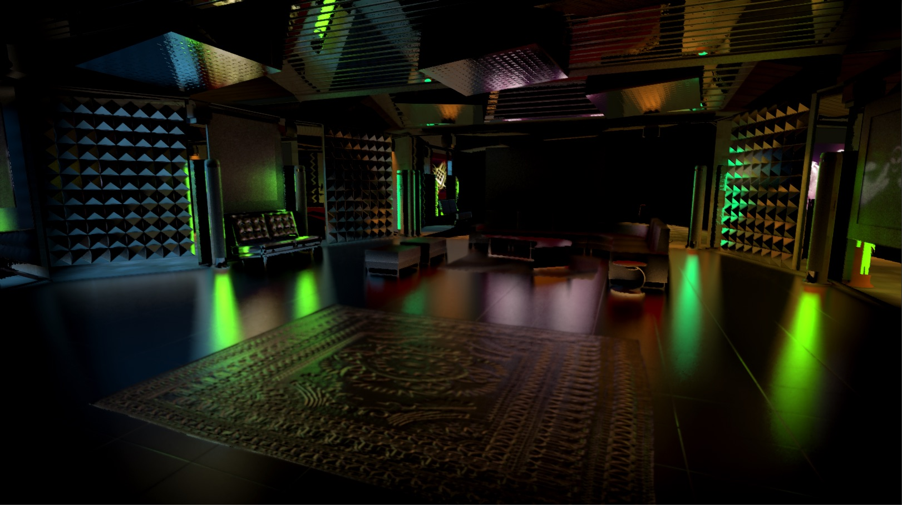
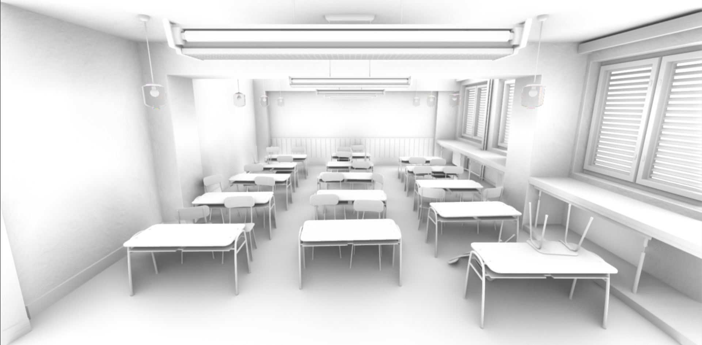

# Unity Screen Space Tech Stack

## Overview

This is a package which contains SSAO, SSDiffuse and SSReflection.

## Display board

### SSGI

SSGI off

SSGI on

SSGI only

### SSReflection

[More Pictures](./Pics/SSGI)

### SSAO(GTAO)

[More Pictures](./Pics/SSAO)

## System requirements

* Unity 2017+ but only test in 2018 and 2019

## Usage

To use this package in your project, just put the ScreenSpaceTechStack folder in the Assets. And attach the corresponding component to the camera.
